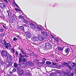

# Histopathologic Cancer Detection

A deep learning project for detecting cancer in histopathology images using a fine-tuned **ResNet18** classifier, with a polished **PyQt6 desktop app** called **Nova** for real-time inference.



---

## Overview

This project tackles the [Histopathologic Cancer Detection](https://www.kaggle.com/competitions/histopathologic-cancer-detection) Kaggle challenge — binary classification of 96×96 histopathology patch images as cancerous or non-cancerous.

| Component | Details |
|-----------|---------|
| Model | ResNet18 (pretrained on ImageNet) |
| Task | Binary classification (cancer / non-cancer) |
| Input size | 96 × 96 px |
| Loss | BCEWithLogitsLoss (class-weighted) |
| Optimizer | AdamW (lr=1e-4, weight_decay=1e-4) |
| Scheduler | ReduceLROnPlateau |
| Mixed precision | torch.amp (CUDA) |
| Early stopping | Patience = 4 epochs |

---

## Project Structure

```
Histopathologic-cancer/
├── model.py       # ResNet18-based CancerModel definition
├── dataset.py     # HistopathDataset — data loading & augmentation
├── train.py       # Training loop with AUC-based early stopping
├── app.py         # Nova — PyQt6 desktop inference app
├── checkpoints/   # Saved model weights (best_model.pt)
└── data/          # Dataset images + _labels.csv (not tracked)
```

---

## Setup

### Requirements

```bash
pip install torch torchvision PyQt6 pandas scikit-learn Pillow
```

### Dataset

Download the dataset from [Kaggle](https://www.kaggle.com/competitions/histopathologic-cancer-detection/data) and place it as:

```
data/
├── _labels.csv
├── <image_id>.tif
└── ...
```

---

## Training

```bash
python train.py
```

**Key hyperparameters** (editable in `train.py`):

| Parameter | Value |
|-----------|-------|
| Epochs | 15 |
| Batch size | 128 |
| Max images | 20,000 (balanced) |
| Validation split | 20% |
| Image size | 96 × 96 |

The best model checkpoint (by validation AUC) is saved to `checkpoints/best_model.pt`.

**Augmentations used during training:**
- Random horizontal & vertical flips
- Random rotation (±15°)
- Color jitter (brightness, contrast, saturation)
- ImageNet normalization

---

## Nova — Desktop App

Nova is a minimal, dark-themed PyQt6 app for running inference on your own histopathology images.

```bash
python app.py
```

**Features:**
- Load TIFF / PNG / JPG images
- Real-time cancer probability prediction
- Confidence progress bar
- Light / dark theme toggle
- Displays cancer probability percentage

> ⚠️ **Research & educational use only — not a medical diagnosis tool.**

---

## Model Architecture

```
ResNet18 (ImageNet pretrained)
└── fc: Sequential(
      Dropout(0.3),
      Linear(512 → 1)
    )
```

Output is a raw logit; `sigmoid` is applied at inference time to get a probability in [0, 1].

---

## License

See [LICENSE](LICENSE).
